.. _transfer:

文件传输
========

用户数据存储空间
-------------------

在ChinaSRC上，系统根据三种 :ref:`usage-mode-ref` 为用户在共享文件系统上分配三种目录，分别是个人目录，项目目录和公共集群目录。

在实例或集群中，这三种目录所对应的路径不同，具体见下表：

.. csv-table:: 
   :header: "", "个人目录", "项目目录", "公共集群目录"
   
   容器实例,/home/username,/group_homes/<project>/home/username,/group_homes/public_cluster/home/username
   虚拟机实例,/webdav/MyData,/webdav/ProjectGroup(<project>),/webdav/ProjectGroup(public_cluster)
   公共集群,/users/username,/groups/<project id>/home/username,/home/username
   WEB页面,独占实例数据-username,共享实例数据-<project显示名>,共享实例数据-public_cluster

.. attention:: 

   username请替换为自己的用户名（这个信息可以在“我的信息”-“基本信息”中查询）。
   
   <project id>请替换为"g+项目ID"（项目基本信息中查询项目ID），例：项目ID为700008，则替换为“g700008”。
   
   <project>请替换为项目名（项目基本信息中查询。）

.. hint:: 

   项目目录和公共集群目录的具体说明请分别查看 :ref:`project data` 和 :ref:`集群数据 <public cluster data>` 。

Web页面数据传输
--------------------

ChinaSRC支持通过Web页面上传下载数据和管理文件。

.. caution:: 通过Web页面上传和下载文件有数量限制，每次最多上传\ **10**\ 个文件，下载\ **1**\ 个文件。

进入“工作台”-“数据总览”，选择相应的数据位置，就可以对个人、项目和公共集群中的数据进行管理。

|web data management|

通过ssh账户传输
-------------------

由于Web传输文件功能有限，对于开放了SSH端口的集群或实例，用户可以通过SSH账户使用scp类的工具来传输数据。

|image4|

以公共集群项目为例，用户在 **项目** -> *public cluster* 的页面里，选择 **实例** ，点击实例最右侧的SSH服务地址按钮，会弹出ChinaSRC对外开放的IP地址和端口：

|ssh ip|

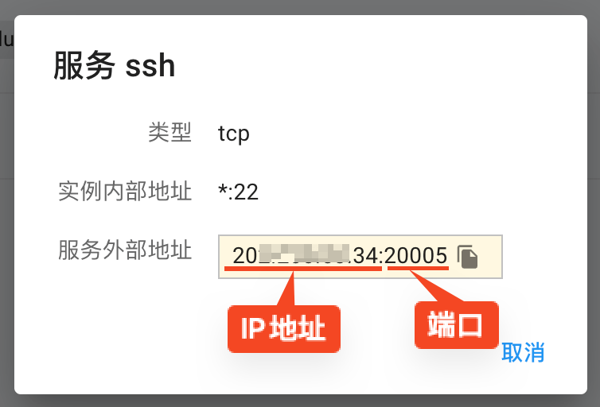

首次使用SSH登录的用户需要 :ref:`重置ChinaSRC密码 <reset password>`

|reset_pw|

用户在能够直接访问ChinaSRC服务IP地址的情况下，可以使用scp、\ `WinSCP <https://winscp.net/eng/docs/lang:chs>`__\ 或\ `Xmanager <https://www.netsarang.com/en/xmanager/>`__\ 等scp工具来传输数据：

.. code:: bash

   scp -P 20139 some_data user@ssh_ip:/home/USERNAME/

使用XFTP传输
~~~~~~~~~~~~~~~~

Windows用户也可以使用\ `XFTP <https://www.xshellcn.com/xftp.html>`__\ 客户端进行传输。

1. 下载并安装XFTP软件后打开，点击“文件”-“新建”。

   |new xftp connection|

   .. |new xftp connection| image:: ../../_static/transfer_new_xftp_connection.png

2. 名称用户可以自定义，主机选项中输入“服务ssh“显示的服务外部地址，端口号填写“服务ssh”中的端口号，协议使用默认的SFTP，用户名和密码填写ChinaSRC的用户名和密码。点击”连接“。

   |set xftp connection|

   .. |set xftp connection| image:: ../../_static/transfer_set_xftp_connection.png

3. 连接后左侧为当前用户计算机的视图，右侧为远程计算机的视图，用户访问的远程计算机路径为\ ``/home/username``\ ，即当前用户的家目录，用户可将文件从个人电脑上传输到共享文件夹内，下方传输栏会显示传输任务详细信息。

   |xftp windows|

   .. |xftp windows| image:: ../../_static/transfer_xftp_windows.png

4. 传输完成后即可在公共集群或实例控制台的用户家目录中看到刚才传输的文件。

   |file in terminal|

   .. |file in terminal| image:: ../../_static/transfer_file_in_terminal.png

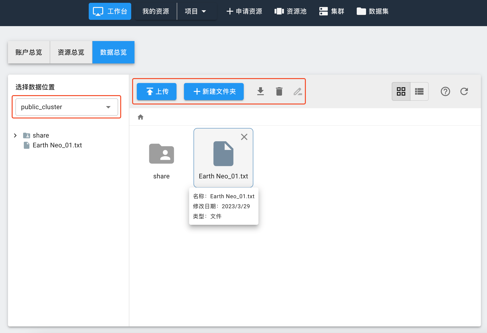
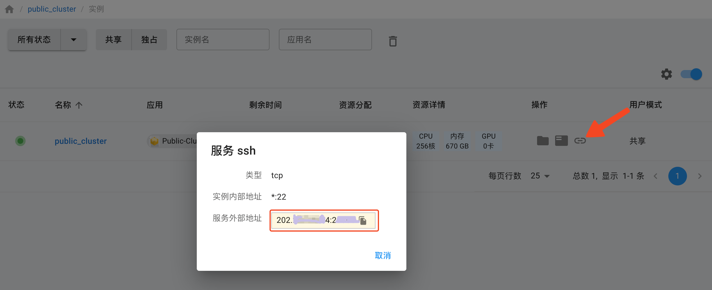
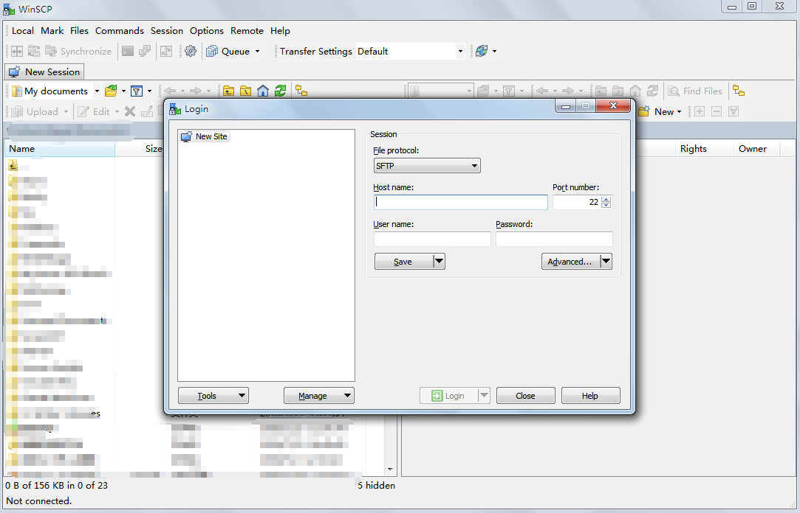
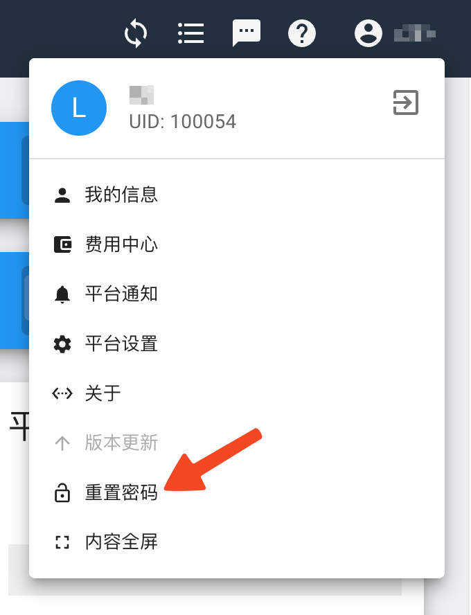
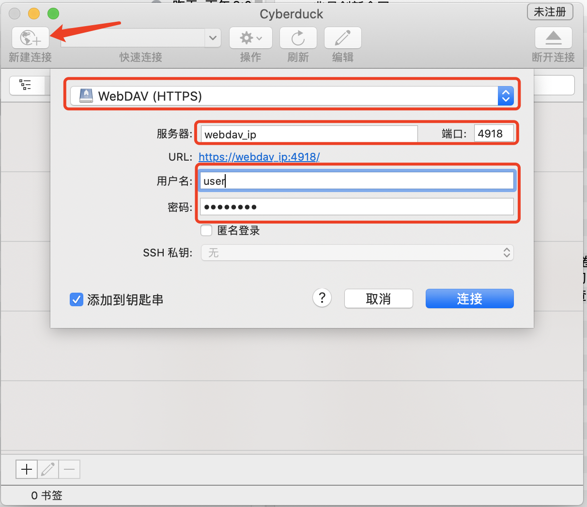
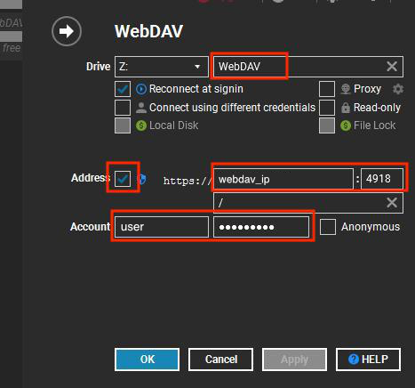
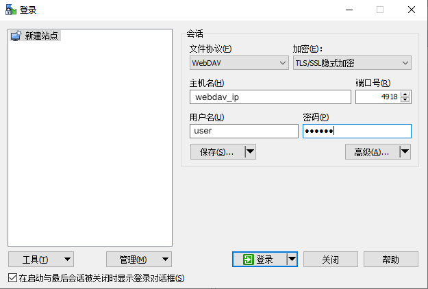
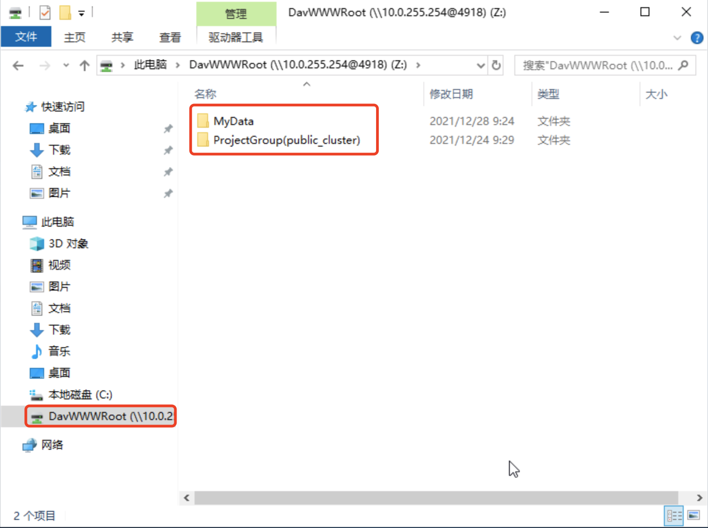
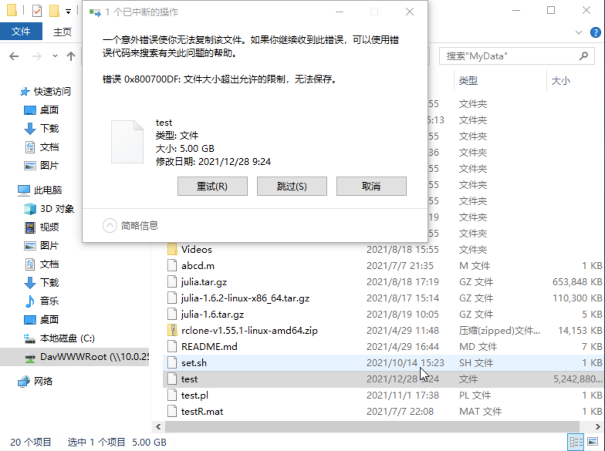
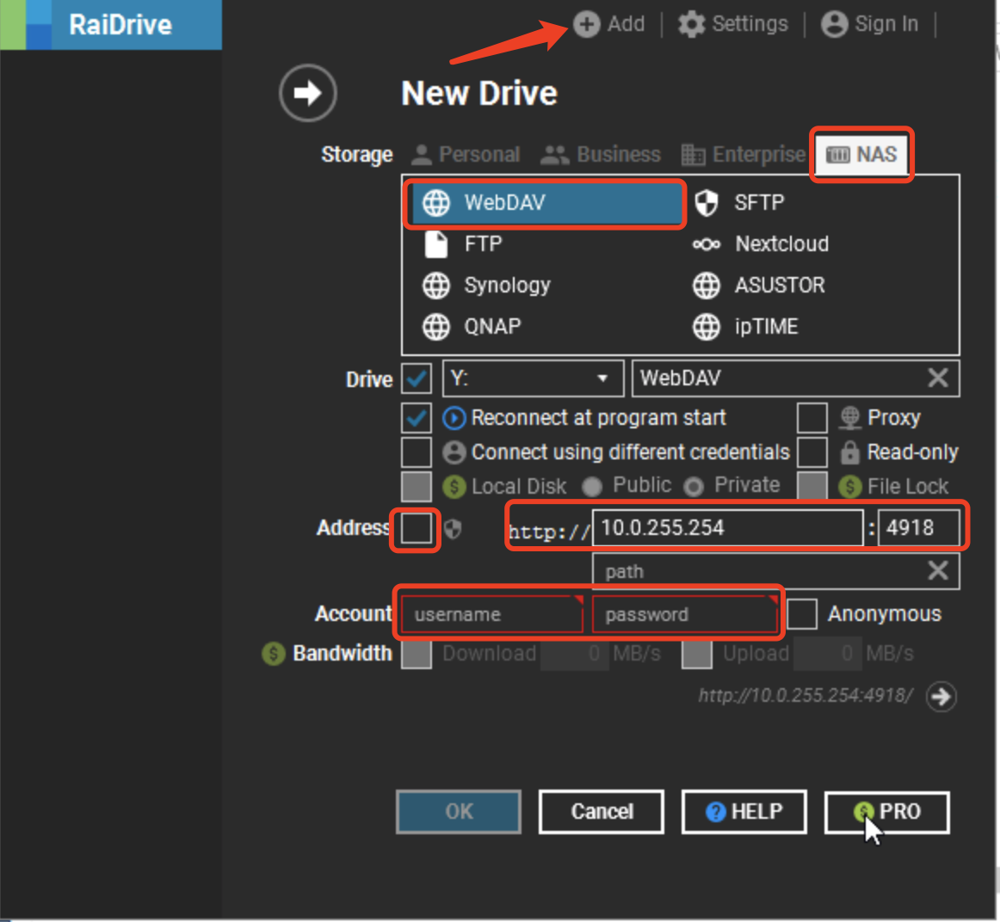
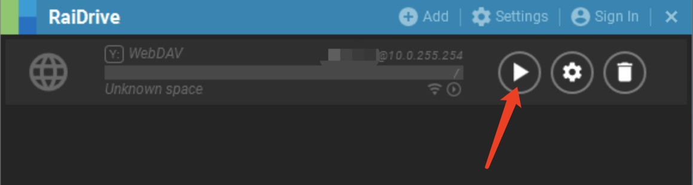
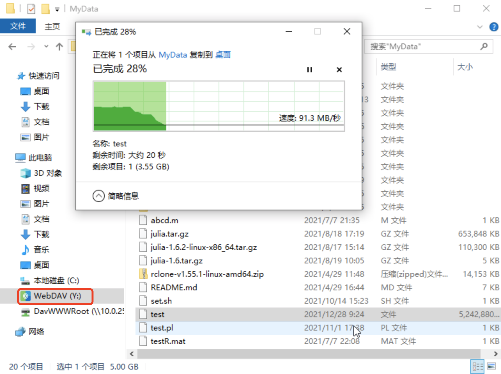
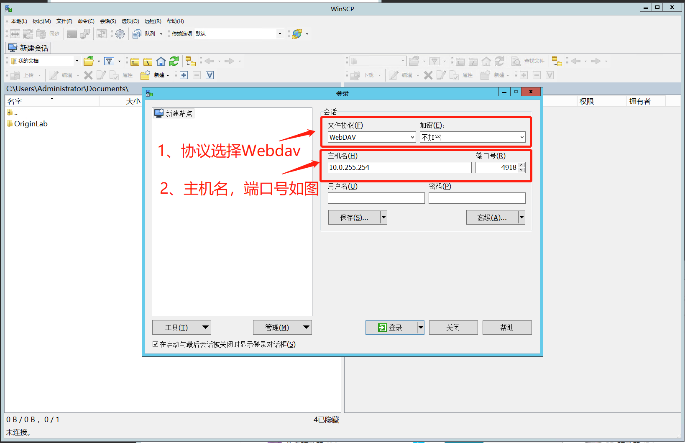
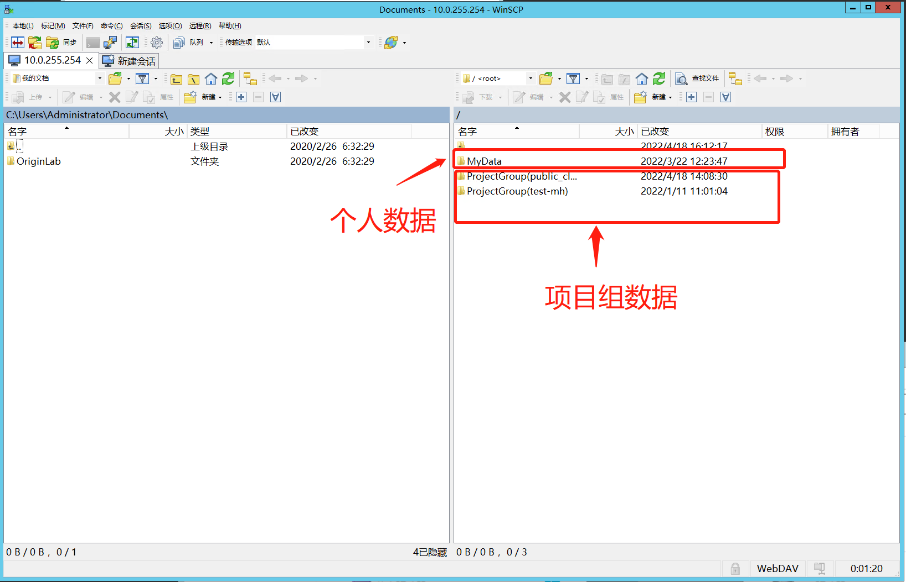