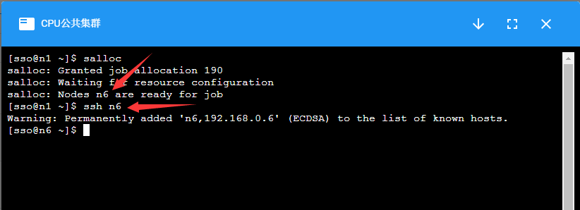
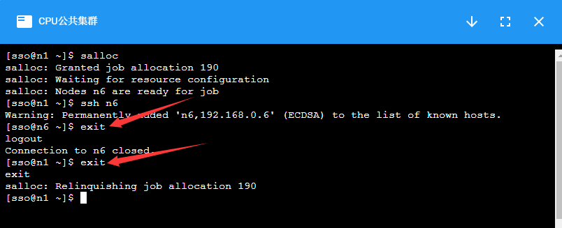

#################################
节点资源抢占命令salloc 
#################################

.. attention:: 

  集群的登录节点设置有资源限制，请勿在登录节点进行大量计算。

集群的计算节点默认不允许用户直接登录，对需要交互式处理的程序，
在登录到集群后，使用\ ``salloc``\ 命令分配节点，然后再ssh到分配的节点上进行处理：

|image3|

计算完成后，使用\ ``exit``\ 命令推出节点，注意需要\ ``exit``\ 两次，
第一次\ ``exit``\ 是从计算节点退出到登录节点，第二次\ ``exit``\ 是释放所申请的资源。

|image4|

该命令支持用户在提交作业前，抢占所需计算资源（此时开始计算所用机时）。

使用示例 
*******************

salloc提交方式如下： 首先申请资源，执行如下命令：

.. code:: bash

   $salloc -N 2 -p arm

   salloc: Granted job allocation 1813522

   #通 过 squeue 查 看 相 应 的 jobID 为 1813522， 节 点 为 taishan-arm-cpu[01-02]。
   $ squeue 
     JOBID PARTITION     NAME     USER ST       TIME  NODES NODELIST(REASON)
   1813522       arm     bash   sername  R       3:42      2 taishan-arm-cpu[01-02]

更多选项，用户可以通过 ``scancel --help`` 命令来查看。