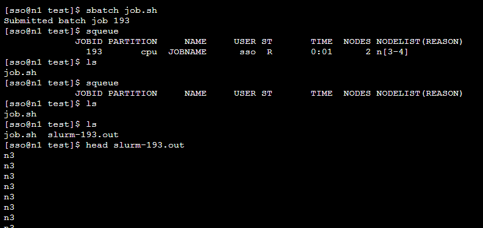

.. _sbatch:

#################################
批处理作业sbatch
#################################

简介
*******************

批处理作业是指用户编写作业脚本，指定资源需求约束，提交后台执行作业。
提交批处理作业的命令为sbatch，用户提交命令即返回命令行窗口，
但此时作业在进入调度状态，
在资源满足要求时，分配完计算节点之后，
系统将在所分配的第一个计算节点（而不是登录节点）上加载执行用户的作业脚本。 

批处理作业的脚本为一个文本文件，
脚本第一行以 ``#!`` 字符开头，并指定脚本文件的解释程序， 如 sh,bash。
由于计算节点为精简环境，只提供 sh 和 bash 的默认支持。

使用示例
*******************

例如用户的脚本名为myjob.sh，内容如下：

.. literalinclude:: ../../src/slurm/myjob.sh

使用该脚本用户提交批处理作业，需要明确申请的资源为 arm 分 区的 4 个节点。

.. note:: 
  
   需给该文本文件设置myjob.sh可执行权限，利用命令： ``chmod +x myjob.sh``

用户sbatch批处理命令如下： 

.. code:: bash
   
   $sbatch -N 4 -p arm ./myjob.sh 
   Submitted batch job 1813520

计算开始后，工作目录中会生成以slurm开头的.out 文件为输出文件。

.. code:: bash

   $cat slurm-1813520.out 
   taishan-arm-cpu03
   taishan-arm-cpu01
   taishan-arm-cpu02
   taishan-arm-cpu04

一个简单的脚本示例如下：

.. code-block:: bash
   :linenos:
   
   #! /bin/bash
   ### 表示这是一个bash脚本

   #SBATCH --job-name=JOBNAME
   ### 设置该作业的作业名

   #SBATCH --nodes=2
   ### 指定该作业需要2个节点数
   
   #SBATCH --ntasks-per-node=40
   ### 每个节点所运行的进程数为40

   #SBATCH --time=2:00:00
   ### 作业最大的运行时间，超过时间后作业资源会被SLURM回收

   #SBATCH --comment project_name
   ### 指定从哪个项目扣费。如果没有这条参数，则从个人账户扣费
   
   mpirun hostname
   ### 程序的执行命令

.. attention:: 

  上述中\ ``###``\ 为注释行。

第一行表示这是一个bash脚本，第4-17行以\ ``#SBATCH``\ 开头的命令表示这些是需要slurm系统处理的参数。

如下图所示，通过\ ``sbatch+作业脚本名``\ 提交作业，系统会返回作业编号，通过\ ``squeue``\ 命令可以看到作业运行状态，等作业执行完成后，默认会把程序的输出放到\ ``slurm-作业编号.out``\ 的文件中，可通过该文件查看程序的输出。

|image6|

常见提交作业参数参考
*********************************

.. list-table::

    * - **参数**
      - **说明**
    * - ``--job­name=<name>``
      - 设定作业名称
    * - ``--nodes=<n>`` 或 ``-N``
      - 设定作业需要的节点数。如果没有指定，默认分配足够的节点来满足\ ``--ntasks=<n>``\ 和\ ``--cpus-per-task=<ncpus>``\ 参数的要求。
    * - ``--ntasks-per-node=<ntasks>``
      - 设定每个节点上的任务数。要和 ``--nodes=<n>`` 同时配合使用。
    * - ``--ntasks=<n>`` 或 ``-n``
      - 设定最多启动的任务数。
    * - ``--cpus-per-task=<ncpus>``
      - 设定每个任务所需要的CPU核数。如果没有指定，默认为每个任务分配一个CPU核。一般运行OpenMP等多线程程序时需要，普通MPI程序不需要。
    * - ``--gres=gpu:n``
      - 设定需要使用的GPU卡数量
    * - ``--comment projectName``
      - 设定需要扣费的项目账户，将 ``projectName`` 替换为项目名称。如果项目名称错误，作业会提交失败。

更多选项，用户可以通过 ``sbatch --help`` 命令来查看。