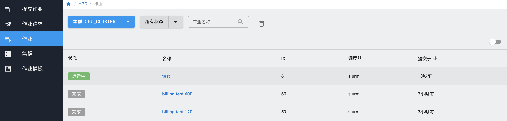

.. _submit job through web:

系统页面提交
#################################

系统支持直接在页面提交作业。

点击上方“集群”按钮，选择“提交作业”。

|submit job web|

选择需要使用的集群和作业模板，填写作业名称，在脚本编辑器里填入作业脚本，点击右上方的“提交作业”按钮。

|submit job|

提交作业后，可以在“作业”页面查看是否提交成功。

|job status|

如果提交的作业有输出，需要下载，等待作业运行完成后，点击作业名称，进入作业详情。

|enter job info|

在“作业输出”页面，点击“下载输出日志”。

|download job output|

