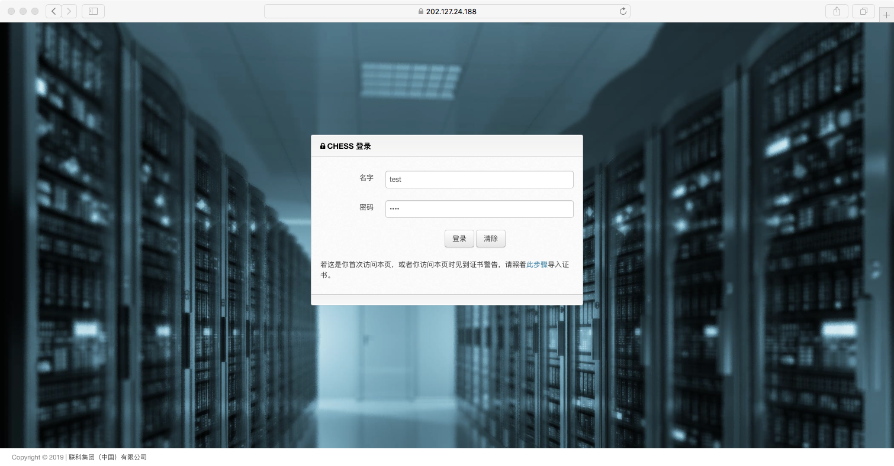
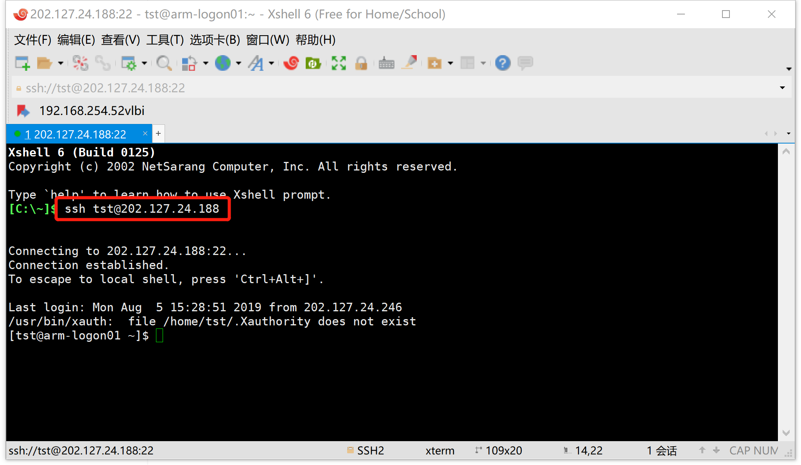
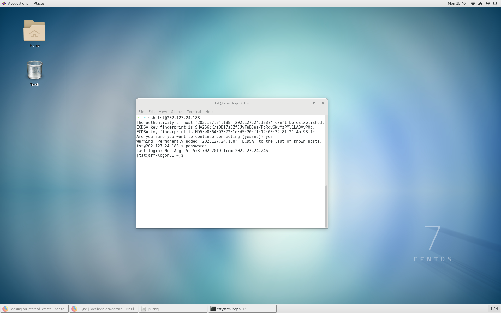
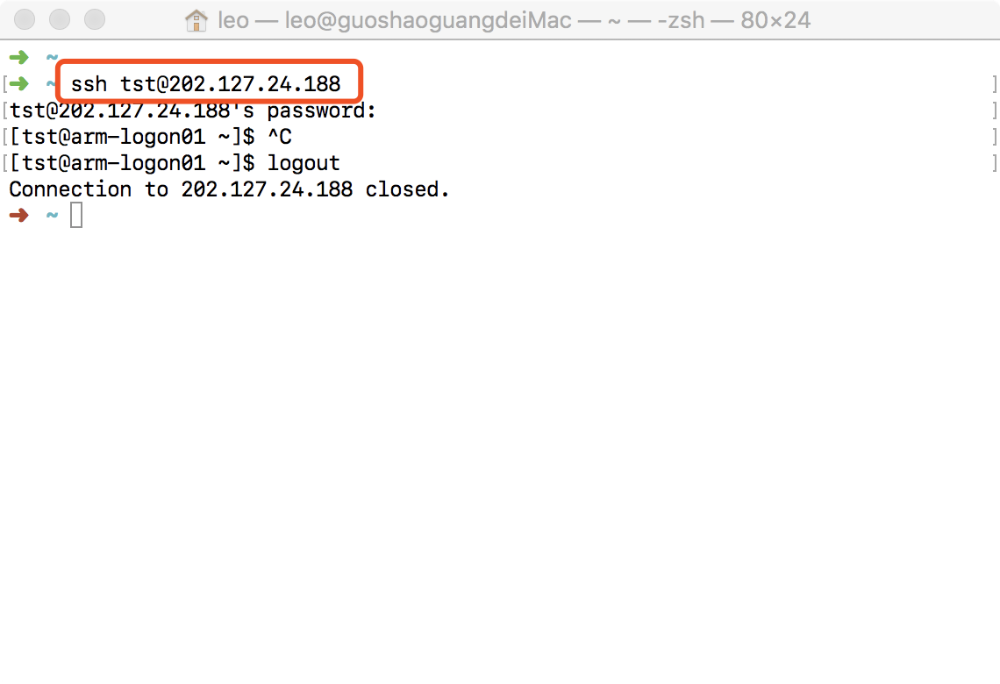

.. _login-inter:

################
台内用户登录
################

.. warning::
   以上成功与数据中心建立了网络连接后，为了进一步保证用户的 数据安全，
   中心不允许telnet等方式登录服务器，必须通过ssh登录 方式来使用中心资源。

Windows操作系统用户可以使用ssh客户端软件 （如Xshell、Xmanager、Putty、SecureCRT）来登录系统。
Linux操作系统或Mac操作系统用户直接使用ssh登录。具体操作可参考下例。

数据中心共有两个登录节点：ARM和X86，它们的IP地址分别是：

+----------+---------------+------+
| 登陆节点 | IP            | 备注 |
+==========+===============+======+
| ARM      | 202.127.3.156 | ARM  |
+----------+---------------+------+
| X86      | 202.127.3.157 | X86  |
+----------+---------------+------+

.. danger::
   用户密码方面，管理员发给用户的是随机密码，为了用户访问安全，账户开通后需要立即修改密码。
   可以通过访问以下网址，在网页 右上角用户信息修改密码：https://202.127.3.156。

用户登录有两种方式，分别为网页版登录和命令行登录。

网页登录
*****************

用户可以通过web界面 https://202.127.3.156/
登录CSRC-P管理系统，如下图所示：

|webloginimage|

输入用户名和密码即可登录。

命令行登录
*****************

Linux和MacOSX用户可以使用terminal终端，Windows用户建议使用xshell，输入命令：

.. code:: bash

   $ ssh username@IP

..

   其中username为用户名
   IP为登陆节点的地址

命令行登录的截图如下所示。

Windows通过xshell登录
~~~~~~~~~~~~~~~~~~~~~

|image2|

Linux通过终端登录
~~~~~~~~~~~~~~~~~

|image3|

MacOSX通过终端登录
~~~~~~~~~~~~~~~~~~

|image4|

.. note:: 普通用户默认情况下分配100G的空间，如有其它需求，请联系管理员进行调额
   （请联系shaoska@shao.ac.cn）。

   用户名和密码等账户信息请通过申请表进行申请。

   请联系shaoska@shao.ac.cn。

