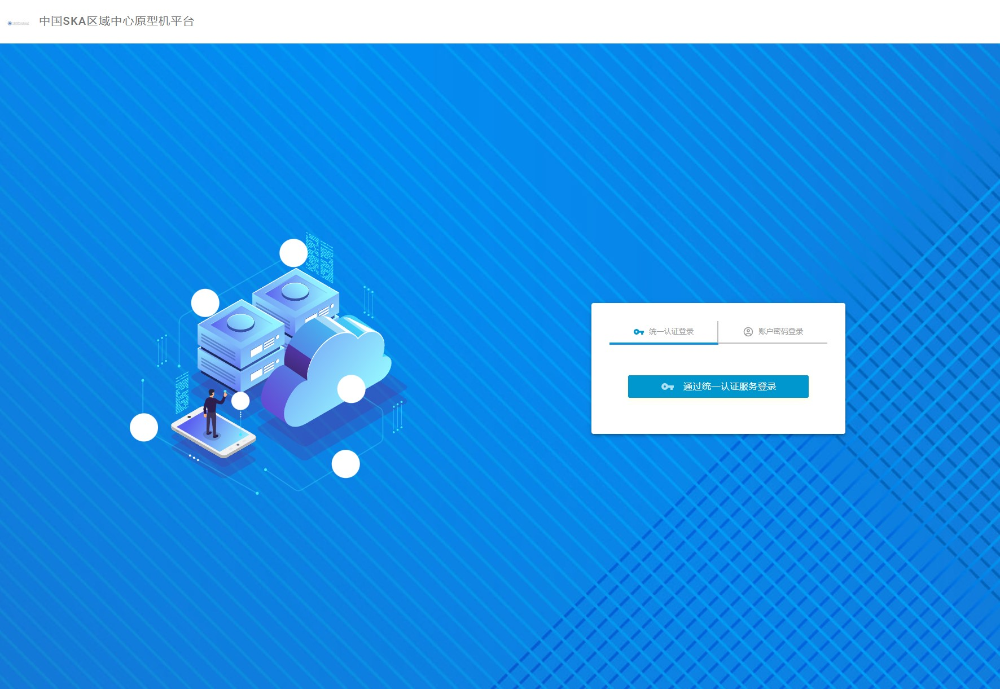
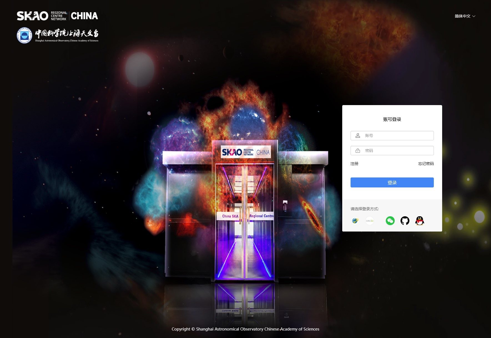
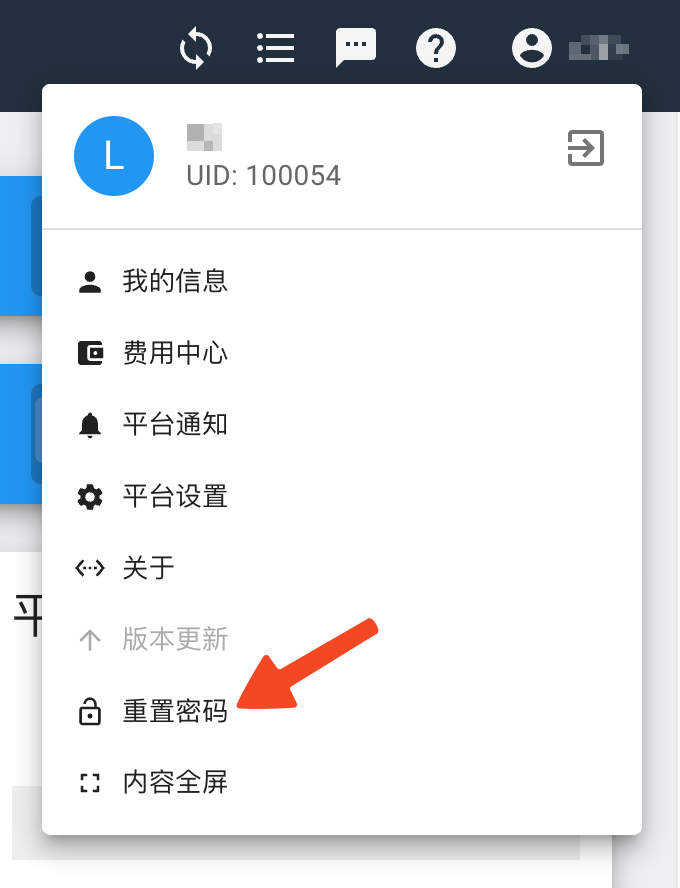
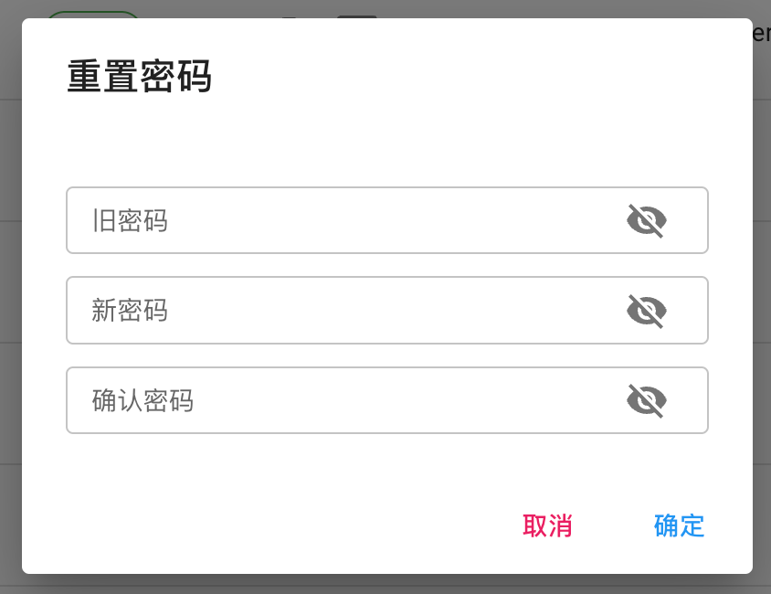
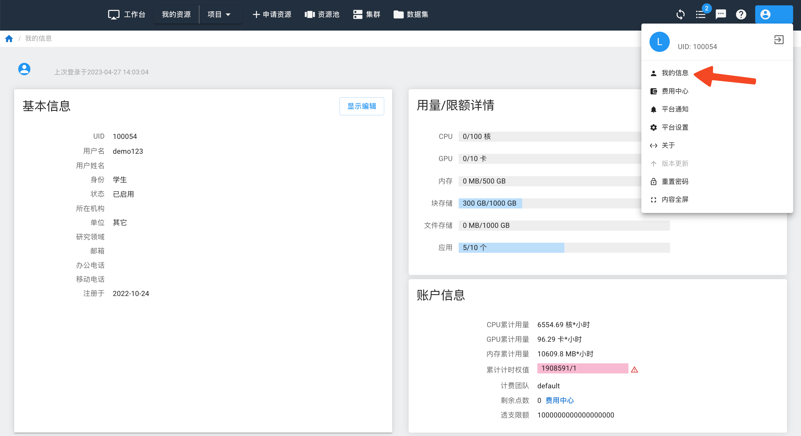
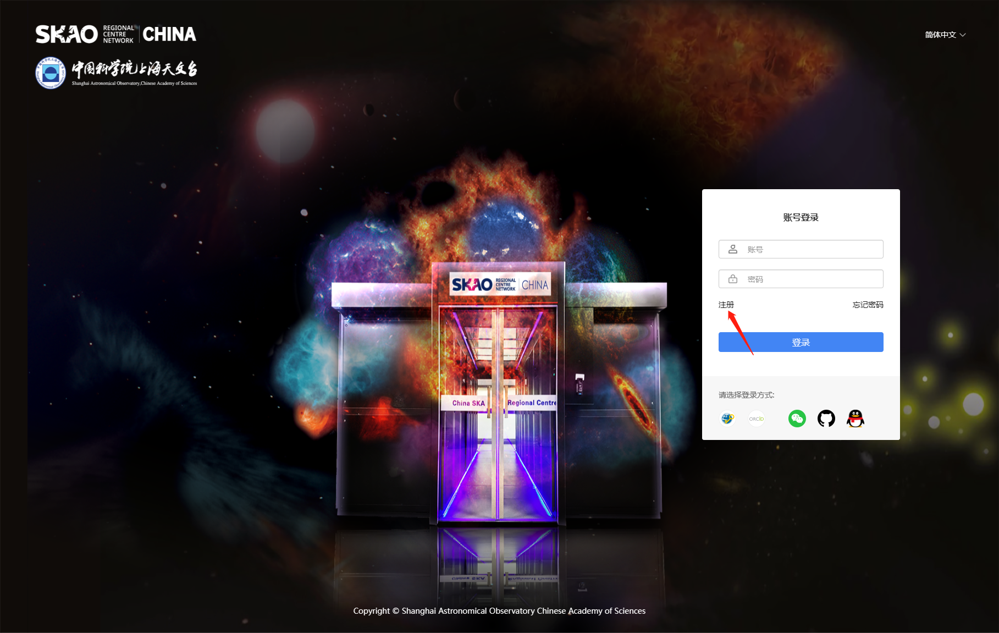
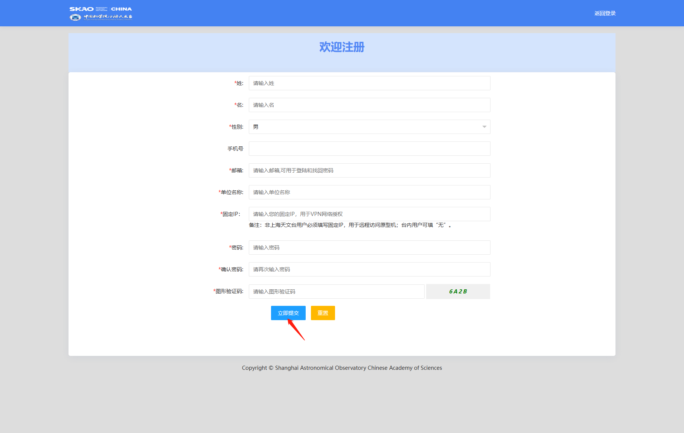

.. _login-inter:

################
台内用户登录
################

.. warning::

   以上成功与数据中心建立了网络连接后，为了进一步保证用户的数据安全，
   中心不允许telnet等方式登录服务器，必须通过ssh登录方式来使用中心资源。

.. danger::
   用户密码方面，管理员发给用户的是随机密码，为了用户访问安全，账户开通后需要立即修改密码。
   可以通过访问以下网址，在网页 右上角用户信息修改密码：http://chinasrc.shao.ac.cn:8882

用户登录有两种方式，分别为网页版登录和命令行登录。

网页登录
-------------------

.. _web login:

用户可以通过web界面 http://chinasrc.shao.ac.cn:8882
点击“通过统一认证服务登录”进入统一身份认证平台，

|loginin|

输入用户名和密码，点击“登录”进入服务平台。
登录ChinaSRC-P管理系统，如下图所示：

|iam|

输入用户名和密码即可登录。

.. _user-register:

用户注册
--------

首次登录要在平台上新注册用户并填写完整用户信息，等待管理员审批通过后，才能登录进入平台。

点击“注册”按钮,

|login-register|

进入到注册界面，填写用户名、密码及其他信息。

|login-submit|

.. attention:: 

  注意通知邮箱填写正确，并且是正常可接收邮件的邮箱。后续审批通过后需要接收首次登录的验证码。

注册申请提交后，管理员会在后台进行审核，审核通过后，邮箱会收到一封邮件：

.. note:: 

   亲爱的用户 xxx 您好，

   您的注册申请已经审批通过，请使用用户名 xxx 、Token \****\*
   及申请注册时所设置的密码进行登录。

   收到这样的邮件，就表示已经通过用户审批，可以登录使用平台了。

首次登录
------------

为了验证邮箱为该注册用户邮箱，所以，在用户进行首次登录的时候，需要采用邮箱收到的验证码进行登录。

直接输入用户进行登录，系统会判断该用户为首次登录用户，就会自动跳转到使用用户名和验证码登录的界面。

输入用户名和邮件收到的验证码，点击登录即可。

正常登录
------------

第一次通过用户名和验证码登录以后，后续登录使用注册时候的密码即可。

.. _reset password:

重置密码
-----------

点击右上角的用户，选择“重置密码”：

|resetpassword|

重置密码时请确认选择足够强度的密码，并保证密码安全。

|resetpassword2|

.. important:: 
   
   登录平台Web页面，以及使用集群登录、SSH连接和WebDAV等平台服务时用的是注册平台的用户名和密码。
   
用户信息
------------

页面右上角，点击用户名称，进入“我的信息”界面，可以查看个人信息，包括注册时填写的基本信息以及用量/限额详情。

|personal info|

用量/限额详情
~~~~~~~~~~~~~~~~

每位用户分配有一定的资源。当创建实例的时候，占用资源限额。如果所用的资源超过了限额，系统会提示资源不够。用户可以先\ :ref:`释放资源 <release resource>`\ ，然后再创建实例。

如果需要资源很多，超过了系统默认限额，用户可以联系管理员修改个人限额。

命令行登录
*****************

Linux和MacOSX用户可以使用terminal终端，Windows用户建议使用xshell，输入命令：

.. code:: bash

   $ ssh username@IP:port

..

其中username为用户名，
IP为登陆节点的地址，
port为登陆节点的端口号，该端口信息可以通过web平台获取。

命令行登录的截图如下所示。

Windows通过xshell登录
~~~~~~~~~~~~~~~~~~~~~

|image2|

Linux通过终端登录
~~~~~~~~~~~~~~~~~

|image3|

MacOSX通过终端登录
~~~~~~~~~~~~~~~~~~

.. code:: bash

   $ ssh username@IP:port

.. note:: 
   
   普通用户默认情况下分配100G的空间，如有其它需求，请联系管理员进行调额
   （请联系shaoska@shao.ac.cn ）。

   用户名和密码等账户信息请通过申请表进行申请。

   请联系shaoska@shao.ac.cn 。

待移除
-------------------

Windows操作系统用户可以使用ssh客户端软件 （如Xshell、Xmanager、Putty、SecureCRT）来登录系统。
Linux操作系统或Mac操作系统用户直接使用ssh登录。具体操作可参考下例。

