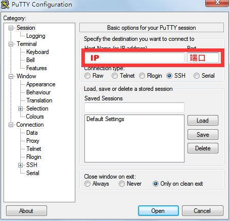

.. _ssh_info:

Check SSH login information
===========================

For shared clusters and exclusive clusters, and instances with built-in SSH services, 
you can log in directly using your local machine. 
If the instance does not have built-in SSH services, you can \ :ref:`start ssh service`\ .

.. attention:: 
   
   Before using SSH to log in for the first time, you need to \ :ref:`reset password <reset password>`\  through the platform management interface.

Each virtual cluster has its own access port, which can be displayed by clicking the icon in the "Workbench" - "Resource Overview" section.

|image4|

Please use the address highlighted in the red box.

|ssh address|

Windows recommends using \ `PuTTY`_,\ `SecureCRT`_,\ `Xmanager`_\ to access the cluster service port, Linux/Mac directly use the terminal.

.. _PuTTY: https://www.chiark.greenend.org.uk/~sgtatham/putty/
.. _SecureCRT: https://www.vandyke.com/products/securecrt/
.. _Xmanager: https://www.netsarang.com/zh/xmanager/
.. _Xshell: https://www.netsarang.com/en/free-for-home-school/

|image5|

.. _ssh login without password:

SSH login without password
===========================

SSH login without password requires a pair of keys, including a public key and a private key, where the private key is placed on the user's local machine, and the public key is placed on the cluster's\ ``~/.ssh/authorized_keys``\ directory. 
When logging in next time, the private key on the user's local machine and the public key on the remote cluster will be verified through the encryption protocol. 
If the verification is successful, the login will be successful without the need for a password. 
So here we need to generate a pair of keys, and upload the public key to the specified position of the target instance.

SSH login without password mainly needs two steps:

1. Generate a pair of keys on the user's local machine.

2. Add the public key to the\ ``~/.ssh/authorized_keys``\ file at the end of the target instance.

Generating a key pair
++++++++++++++++++++++++

MacOS & Linux
~~~~~~~~~~~~~~~~~~

Directly use the terminal to generate the public and private keys on the user's local machine.

Type the command\ ``ssh-keygen -t rsa``:

.. code-block:: bash

   ssh-keygen -t rsa

The terminal will prompt:

.. code-block:: bash

   Generating public/private rsa key pair.
   Enter file in which to save the key (/Users/~your-local-username~/.ssh/id_rsa):

The parentheses contain the default directory location of the generated public and private keys, directly press Enter to use this default location.

|mac ssh keygen|

If the default location has already generated a public and private key, the terminal will prompt whether to overwrite, 
in this case, you can skip the generation of the public and private keys.

.. code-block:: bash

   /Users/~your-local-username~/.ssh/id_rsa already exists.
   Overwrite (y/n)?

The terminal will prompt you to enter the password passphrase, this password is the password for generating the private key, 
to prevent the private key from being used by others. Here you can enter any password, press Enter, 
and then prompt you to enter the password again, press Enter again.

|mac set keygen passphrase|

The public key is stored in the\ ``/Users/~your-local-username~/.ssh/id_rsa.pub``\ file, 
the private key is stored in the\ ``/Users/~your-local-username~/.ssh/id_rsa``\ file.

|mac list keygen|

Get the public key, copy the return value to the clipboard.

.. code-block:: bash

   cat ~/.ssh/id_rsa.pub

|mac copy public key|

Windows
~~~~~~~~~~~~~~

You can generate a public and private key using\ `PuTTY`_\ or\ `Xshell`_\. 
Below is an example of using the Xshell software to generate a public and private key.

Open the Xshell tool, there is a tool option in the toolbar, click to open and select the new user key generation wizard.

|xshell new user key|

The key type defaults to RSA, the key length defaults to 2048 bits, click Next.

|xshell generate key|

Wait for the software to automatically generate the key pair and click Next.

|xshell waiting for key|

Follow the software instructions to configure the key name and password, then click Next.

.. attention:: 

   This password encrypts your private key file, if you forget it, you need to regenerate the public and private keys and add them to the cluster again, please remember!

|xshell set key information|

The software will display the generated public key, select the public key and copy it to the clipboard, then click Finish, and save the public key as a file.

|xshell copy public key|

|xshell save public key|

Add the public key to the cluster
++++++++++++++++++++++++++++++++++++

Next, you need to append the public key you just copied to the\ ``~/.ssh/authorized_keys``\ file in the cluster. 
First use\ :ref:`Web SSH login <web login>`\ to log in to the cluster, and then input the following command in the Web terminal:

.. code-block:: bash

   echo "ssh-rsa AAAA..." >> ~/.ssh/authorized_keys

Replace ``ssh-rsa AAAA..``\ with the public key you just copied.

Use the key to log in to the cluster
++++++++++++++++++++++++++++++++++++

MacOS & Linux
~~~~~~~~~~~~~~

Open the built-in terminal on your local machine, according to\ :ref:`ssh_info`\ to view the SSH IP and port information of the cluster to be logged in, 
input the following command and press Enter to log in to the cluster:

.. code-block:: bash

   ssh -p PORT username@IP 

Replace \ ``IP``\ and \ ``PORT``\ with the SSH IP address and port of the cluster, and \ ``username``\ with your platform username.

If you see a similar prompt, enter\ ``yes``\ and press Enter, then you can log in normally.

.. code-block:: bash

   The authenticity of host 'IP (IP)' can't be established.
   ECDSA key fingerprint is xx:xx:xx:xx:......:xx.
   Are you sure you want to continue connecting (yes/no)

Windows
~~~~~~~~~~~~~~

Here is an example of using\ `Xshell`_\ to log in.

Click the new session property in the upper left corner of the software, according to\ :ref:`ssh_info`\ to view the SSH IP and port information of the cluster to be logged in, 
input the SSH IP address and port, then click Connect.

|xshell new login|

Input the platform username and click OK.

|xshell enter username|

In the user authentication interface, select "Public Key" and select the public key file saved locally in the previous section. 
If a key password was set when generating the key pair, you also need to input the password.

|xshell import public key|

Click Confirm, successfully login.

|xshell login successfully|

.. _start ssh service:

SSH service configuration
--------------------------

Start the instance, open the terminal to install the ssh service

.. code-block:: bash

   sudo yum install openssh-server

Start the ssh service

.. code-block:: bash

   sudo service sshd start

If you see the prompt\ ``service command not found``\，execute the following command:

.. code-block:: bash

   sudo yum install initscripts -y

Change the user password

.. code-block:: bash

   sudo -i
   passwd Usename

Then input the new password.

Use the ssh tool to remotely log in to the instance.

.. |image4| image:: ../../_static/cluster_login_image5.png
.. |ssh address| image:: ../../_static/cluster_login_ssh_address.png

.. |mac ssh keygen| image:: ../../_static/cluster_login_mac_ssh_keygen.png
.. |mac set keygen passphrase| image:: ../../_static/cluster_login_mac_set_keygen_passphrase.png

.. |xshell new user key| image:: ../../_static/cluster_login_xshell_new_user_key.png
.. |xshell generate key| image:: ../../_static/cluster_login_xshell_generate_key.png

.. |xshell set key information| image:: ../../_static/cluster_login_xshell_set_key_information.png
.. |xshell copy public key| image:: ../../_static/cluster_login_xshell_copy_public_key.png

.. |xshell new login| image:: ../../_static/cluster_login_xshell_new_login.png

.. |xshell import public key| image:: ../../_static/cluster_login_xshell_import_public_key.png
