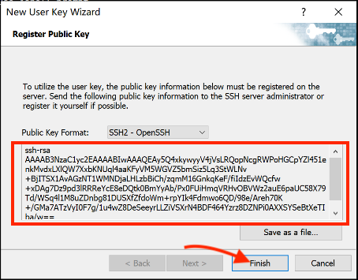

.. _ssh_info:

查看SSH登录信息
===========================

对于共享集群和独占集群，以及自带SSH服务的实例可以通过本地机器直接登录。如果实例没有自带SSH服务，可以\ :ref:`自行配置 <start ssh service>`。

.. attention:: 
   
   在首次使用SSH登录之前，需要通过平台管理界面\ :ref:`重置密码 <reset password>`。

每套虚拟集群有自己的访问端口，在“工作台”-“资源总览”中通过点击如图所示图标可显示集群的IP和端口信息。

|image4|

请使用红框框选出的地址。

|ssh address|

Windows推荐使用\ `PuTTY`_，`SecureCRT`_，`Xmanager`_\ 等客户端访问集群的服务端口，Linux/Mac直接使用终端即可。

.. _PuTTY: https://www.chiark.greenend.org.uk/~sgtatham/putty/
.. _SecureCRT: https://www.vandyke.com/products/securecrt/
.. _Xmanager: https://www.netsarang.com/zh/xmanager/
.. _Xshell: https://www.netsarang.com/en/free-for-home-school/

|image5|

.. _ssh login without password:

SSH免密码登录
===========================

SSH免密码登录需要一对密钥对，包括一个公钥和一个私钥，其中私钥放在用户本机，公钥放在集群的\ ``~/.ssh/authorized_keys``\ 目录。下次登录时，用户本机的私钥和远程集群的公钥通过加密协议验证配对，验证成功后将不需要密码直接登录成功。所以这里需要生成公私钥，并将公钥上传到目标实例的指定位置。

使用SSH客户端免密码登录主要需要两步：

1. 在用户本机生成公私钥。

2. 将公钥添加到计算云目标实例的\ ``~/.ssh/authorized_keys``\ 文件末尾。

生成密钥对
+++++++++++++++++

MacOS & Linux
~~~~~~~~~~~~~~~~~~

直接使用终端在用户本机生成公钥和私钥。

输入命令\ ``ssh-keygen -t rsa``：

.. code-block:: bash

   ssh-keygen -t rsa

终端会提示：

.. code-block:: bash

   Generating public/private rsa key pair.
   Enter file in which to save the key (/Users/~your-local-username~/.ssh/id_rsa):

括号内为生成的公私钥的默认目录位置，直接回车就会使用这个默认位置。

|mac ssh keygen|

如果默认位置已经生成过公私钥，则终端会提示是否需要覆盖，这时可不用再次生成公私钥。

.. code-block:: bash

   /Users/~your-local-username~/.ssh/id_rsa already exists.
   Overwrite (y/n)?

终端会提示输入密码 passphrase，这个密码为生成私钥的密码，将来防止私钥被其他人盗用。这里可以不输入任何密码，直接回车，再次提示输入密码，再次回车。

|mac set keygen passphrase|

这时公钥存储在\ ``/Users/~your-local-username~/.ssh/id_rsa.pub``\ 文件里，私钥存储在\ ``/Users/~your-local-username~/.ssh/id_rsa``\ 文件里。

|mac list keygen|

获取公钥，将返回值拷贝到剪贴板。

.. code-block:: bash

   cat ~/.ssh/id_rsa.pub

|mac copy public key|

Windows
~~~~~~~~~~~~~~

可以通过\ `PuTTY`_\ 或\ `Xshell`_\ 生成公私钥。下面以Xshell软件为例，介绍公私钥生成。

打开Xshell工具，工具栏有一个工具选项，点开选择新建用户密钥生成向导。

|xshell new user key|

密钥类型默认使用RSA，密钥长度默认2048位，点击下一步。

|xshell generate key|

等待软件自动生成密钥对后点击下一步。

|xshell waiting for key|

按照软件指引配置密钥名称和密码后点击下一步。

.. attention:: 

   该密码加密您的私钥文件，若遗忘，则需要重新生成公私钥并重新添加至集群，请牢记！

|xshell set key information|

软件会显示生成的公钥，选中公钥复制到剪贴板，然后点击结束，将公钥另存为文件。

|xshell copy public key|

|xshell save public key|

将公钥添加到集群
+++++++++++++++++

接下来需要将刚刚复制的公钥追加到集群内\ ``~/.ssh/authorized_keys``。先使用\ :ref:`Web SSH登录 <web login>`\ 到集群，在Web终端中输入如下命令：

.. code-block:: bash

   echo "ssh-rsa AAAA..." >> ~/.ssh/authorized_keys

其中，将``ssh-rsa AAAA..``\ 替换为刚才复制的公钥。

用密钥登录集群
++++++++++++++++

MacOS & Linux
~~~~~~~~~~~~~~

本地机器上打开自带的终端，按照\ :ref:`ssh_info`\ 查看要登录的集群SSH IP和端口信息，输入如下命令后回车登录集群：

.. code-block:: bash

   ssh -p PORT username@IP 

其中，\ ``IP``\ 和\ ``PORT``\ 分别替换为集群的SSH IP地址和端口， \ ``username``\ 替换为自己的平台用户名。

如果显示类似如下提示，输入\ ``yes``\ 后回车，即可正常登录。

.. code-block:: bash

   The authenticity of host 'IP (IP)' can't be established.
   ECDSA key fingerprint is xx:xx:xx:xx:......:xx.
   Are you sure you want to continue connecting (yes/no)

Windows
~~~~~~~~~~~~~~

此处以\ `Xshell`_\ 登录为例。

点击软件左上角新建会话属性，按照\ :ref:`ssh_info`\ 查看要登录的集群SSH IP和端口信息，输入SSH IP地址和端口后点击连接。

|xshell new login|

输入平台用户名后点击OK。

|xshell enter username|

在用户身份验证界面选择“Public Key” 选择上文中保存在本地的公钥文件。如果之前在生成密钥对时设置了密钥密码，还需要一并输入密码。

|xshell import public key|

点击确认，成功登录。

|xshell login successfully|

.. _start ssh service:

SSH服务配置
--------------

启动实例，打开终端安装ssh服务

.. code-block:: bash

   sudo yum install openssh-server

开启ssh服务

.. code-block:: bash

   sudo service sshd start

如果提示\ ``service command not found``\，执行如下命令：

.. code-block:: bash

   sudo yum install initscripts -y

更改用户密码

.. code-block:: bash

   sudo -i
   passwd Usename

然后输入新密码。

用ssh工具远程登陆实例。

.. |image5| image:: ../../_static/cluster_login_image6.png

.. |mac list keygen| image:: ../../_static/cluster_login_mac_list_keygen.png
.. |mac copy public key| image:: ../../_static/cluster_login_mac_copy_public_key.png

.. |xshell waiting for key| image:: ../../_static/cluster_login_xshell_waiting_for_key.png

.. |xshell save public key| image:: ../../_static/cluster_login_save_pulic_key.png

.. |xshell enter username| image:: ../../_static/cluster_login_xshell_enter_username.png

.. |xshell login successfully| image:: ../../_static/cluster_login_xshell_login_successfully.png