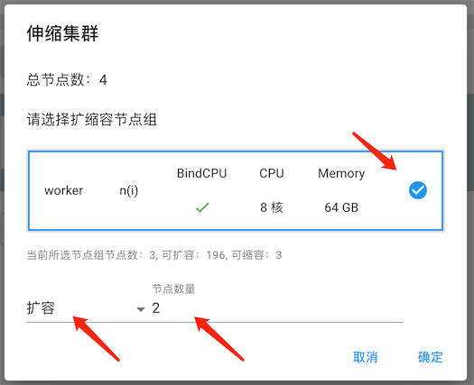

.. _instance detail:

用户实例
===========

在“实例”中，用户点击实例名称，可以查看实例的基本信息、资源详情、服务和集群，
并对实例进行操作。

.. note:: 

    此处显示的实例包含\ :ref:`独占实例 <apply private instance>`\ 和\ :ref:`独占集群 <apply private cluster>`。

实例详情
----------

|instance information|

基本信息
~~~~~~~~~~~

基本信息显示当前实例的运行状态、运行剩余时间、健康状态、资源分配状态、创建实例所用的应用、创建时间。

|instance basic information|

资源详情
~~~~~~~~~~~

资源详情显示当前实例所使用的CPU核数、内存数、GPU数、块存储和镜像。

|instance resource information|

服务
~~~~~~~~~~~

服务显示该实例当前的健康状态和开通的功能，例如控制台、交互界面和SSH等。可以点击图标选择相应的服务，也可以\ :ref:`添加自定义服务 <customize service>`。

|instance service information|

集群
~~~~~~~~~~~

集群显示了当前资源所使用的节点和节点的详细信息。

|instance node information|

根据用户创建的类型不同，节点数量也不同，有的为单节点\ :ref:`独占实例 <apply private instance>`\ ，有的为\ :ref:`独占集群 <apply private cluster>`。

|instance single node|

|instance multiple nodes|

可以点击节点图标，切换下方的节点详细信息。

|change node|

节点详细信息包含如下：

**名称**：节点名称。

**ID**：节点的ID。

**类型**：分为“CTRT容器”，“OCI容器”和“虚拟机”。“CTRT容器”是专为集群开发的容器，根据集群的需求可以进行更细粒度的控制。“OCI容器”是Docker的标准化容器。

**角色**：分为“主节点”、“工作站”和“计算节点”。“主节点”是作业队列系统的管理节点，负责接受用户提交的任务，进行任务调度和分发。“工作站”节点主要用于用户登录、作业提交、作业查看、文本编辑、数据传输等工作。“计算节点”用于处理用户的计算任务。

**运行状态**：显示节点当前的运行状态，例如“运行中”、“等待”、“暂停”、“错误”等等。

**物理节点**：显示当前节点所在的物理节点。

**资源分配**：当前节点所占用的资源。

**资源使用统计**：最近6小时的CPU和内存使用情况。

.. _change state:

启动/停止实例
---------------

实例详情的右上角，有“启动”和“停止”按钮，点击后就可以运行或停止实例。

|change state|

实例延期
-----------

为了充分的利用资源，每个实例都设有默认的最长使用期限。当创建实例成功后就开始倒计时，倒计时为零时，系统会自动停止该实例释放资源。如果用户希望延长实例的使用时间，可以申请对实例延期。

点击“实例”中的“申请延期”。

|apply delay|

在窗口中选择需要延期的类型，填写希望延长的时间和理由，并提交管理员审批。

|select extend type 1|

|select extend type 2|

* **延后实例本次运行的截止日期**：延期申请只针对当前正在运行的实例，不影响之后的实例运行。
* **更新实例的使用期限**：申请用户该实例的默认最长使用期限，只对下次及以后的运行有效。

.. attention:: 

    如果要对当前正在运行的实例进行延期，请预留审批时间，避免在快截止时提出申请。

用户可以在“申请”中查看自己已经提交的延期请求以及审批情况。

|approval state|

.. attention:: 

    如果实例有还未审批的请求，不允许对该实例提交相同类型的延期请求。需要等审批完毕后才能再次提交。

.. _release resource:

资源释放
----------------

.. attention:: 
   实例会从创建开始计费，直到自动或手动释放资源停止计费。因此如果资源使用完毕，记得及时手动释放资源。

实例只有在停止状态下才能释放资源。:ref:`停止实例 <change state>`\ 后，点击“释放资源”按钮，并停止计费。

|release|

已经释放资源的实例会进入“回收站”，用户可以在“回收站”里找到实例，并重新分配资源，进入计费状态。

|allocate|

.. note:: 

    进入“回收站”的实例的数据和环境都依然保存。如果希望彻底删除，点击删除图标，将实例和数据彻底删除。  

.. _expand:

磁盘扩容
-----------------

实例只有在停止状态下才能磁盘扩容。:ref:`停止实例 <change state>`\ 后，在列表中点击磁盘扩容按钮，或是在实例详情中点击磁盘扩容按钮。

|expand disk|

|expand disk2|

在弹出窗口中，通过滑条或是直接输入磁盘尺寸调整所需要的磁盘大小后，点击确定完成扩容。

|set disk volume|

.. attention::

    扩容大小在2048G范围内，实例自动扩容，无需其他额外操作，直接使用扩容空间。
    
    扩容大小在2048G以上，需要按照以下教程操作。

扩容完成后，启动实例，进入到实例中。

在命令行输入\ ``lsblk``\ ，查看磁盘扩容情况，本次扩容空间大小为20T，见下图：

|check disk volume|

在命令行继续输入\ ``df -Th``\ 查看磁盘的格式，主要包含ext4或者xfs两种，本次实例查看见下图：

|check disk format|

可以看到，``lsblk``\ 和\ ``df -Th``\ 两个命令看到的磁盘大小是不一样的。用\ ``lsblk``\ 看到的是20T，但是用\ ``df -Th``\ 查看只有49G，两者存在差异。这是因为\ ``lsblk``\ 查看的是block device，即逻辑磁盘大小。\ ``df``\ 查看的是file system, 即文件系统层的磁盘大小。磁盘扩容后，block device容量变大，但还没有反映到file system中，需要用resize2fs 命令来更新。

在命令行输入\ ``resize2fs /dev/vda1``\ 进行更新，扩容时间视扩容空间大小而定，扩容20T需要几分钟的时间，提示如下图所示内容，表示扩容完成。

|resize disk|

在命令行输入\ ``df -Th``\ 查看扩容后的磁盘空间，可以看到已经变为20T。

|check disk volume2|

.. attention::

    \ ``resize2fs``\ 只可用于调整ext4文件系统的大小。
    
    如果分区类型为xfs，则执行\ ``xfs_growfs /dev/vda1``\ 进行扩容，操作过程和ext4一样。

.. _change resource:

修改配置
-----------

如果觉得创建的实例资源不够，比如希望增加CPU核数、GPU卡数或是内存，可以修改实例的资源配置。

停止实例，并释放资源，在“我的资源”-“回收站”里找到实例，点击右侧的“修改配置”，在弹出窗口中选择需要的资源配置。

|change resource|

|set resource|

修改资源配置后，为实例\ :ref:`重新分配资源 <allocate resource>`\ 并启动即可。

.. attention:: 

    每个实例是否可更改资源配置以及可选的资源配置，取决于管理员对应用的设置。

.. _customize service:

添加自定义服务
----------------

平台支持用户增加自定义服务，目前只支持自助添加和删除TCP端口映射。点击右上角的“添加自定义服务”。

|customize service|

在弹出窗口中输入服务名称，容器或虚拟机内部监听的服务地址，端口和所在节点。

|set service|

.. attention:: 

    端口名称不可以跟保留的名称，即平台已使用的ssh, desktop, jupyter等重名。 用户也不可添加和删除spec里已经配的端口映射。

集群扩缩容
-----------

.. attention:: 

    只有\ :ref:`独占集群 <apply private cluster>`\ 才可以扩容缩容，\ :ref:`独占实例 <apply private instance>`\ 的资源分配在申请资源时设定。

点击集群右侧“伸缩集群”按钮。

|private cluster set resource|

在弹出窗口中，选择扩缩容节点组，选择扩容还是缩容，以及相应的节点数。

|private cluster set resource window|

