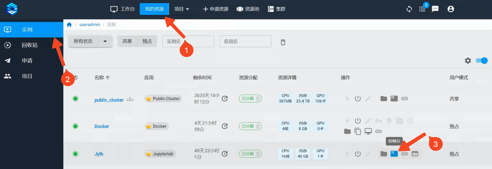

.. _usage-mode-ref:

使用模式
==========

模式对比
--------

为了满足复杂多样的个性化计算需求，适应新型计算模式对运行环境的复杂要求，
高性能计算平台的建设除了在硬件设备的选型上充分考虑了计算的多样性，
提供了包含CPU节点、ARM节点和GPU节点等的丰富算力组合，
在软件平台的建设上也采用了区别于传统超算中心的作业调度系统的解决方案，
在不损失计算性能的前提下以灵活多样的方式提供服务。

.. attention:: 
    
    **资源多≠速度快**，无论使用以下哪种方式申请计算资源，并不意味着申请的资源越多，计算速度就会越快。程序必须经过并行计算优化，才能取得更快的计算速度，比如，CPU程序要经过多核优化，GPU程序要利用CUDA加速。

.. list-table:: Usage Mode
   :widths: 15 30 30 30

   * - 
     - **公共集群**
     - **独占集群**
     - **独占/共享实例**
   * - **适用人群** 
     - 对Linux命令行和作业调度系统比较熟悉。
     - 对Linux命令行和作业调度系统比较熟悉，计算量非常大。
     - 不熟悉Linux，习惯交互式图形界面，计算量相对较小，使用图形界面快速实验验证一些想法。**无计算机背景的新用户建议使用这种模式。** 
   * - **应用场景**
     - 全体共享一个计算集群，多用户排队提交作业
     - 个人/院系独占集群资源，可自定义集群内部运行环境，自主安装系统应用
     - 个人独占/多人共享单节点资源
   * - **执行方式**
     - SLURM作业提交
     - 自主安装作业调度系统或直接多节点并行
     - 交互式提交
   * - **节点数量**
     - 预分配固定节点
     - 规模可伸缩
     - 单节点
   * - **应用类型** 
     - 绝大多数计算任务
     - 绝大多数计算任务
     - CentOS、Ubuntu系统，Jupyter、RStudio、MATLAB等有交互界面的计算任务。
   * - **申请资源** 
     - 编写资源申请脚本，使用作业调度软件提交作业
     - Web页面申请集群，编写资源申请脚本，登录集群后提交作业
     - 在Web界面申请资源，使用Linux命令行或者VNC操作服务器
   * - **计费方式**
     - 从作业启动后开始计费，直到作业结束，作业结束后资源自动释放。 
     - 从启动计算资源开始计费，直到资源释放为止。有最长使用期限，超过最长使用期限后系统自动释放资源，用户也可以自己手动释放资源。 
     - 从启动计算资源开始计费，直到资源释放为止。有最长使用期限，超过最长使用期限后系统自动释放资源，用户也可以自己手动释放资源。 
   * - **图形界面**
     - 不支持
     - 支持
     - 支持
   * - **客户端ssh**
     - 支持
     - 支持
     - 不支持
   * - **root权限** 
     - 否
     - 是
     - 是

如上表所示，平台主要支持三种模式：

1. 对于计算资源使用量较大、有一定Linux命令行基础的用户，可以考虑使用\ **公共集群**\ 或者\ **独占集群**\ 模式。这两种模式都使用作业调度系统提交作业。不同在于\ **公共集群**\ 按作业运行时长来计费，\ **独占集群**\ 的计费从分配资源开始到资源释放，如果中间并未运行作业，依然计费。
2. 如果对Linux命令行不熟悉，我们提供了\ **独占/共享实例**\ 模式，可以在“申请资源”处申请有交互界面的计算资源，提供了Jupyter等有交互界面的工具，上手简单，无需学习Linux，适用于无计算机背景的新用户。此模式优点是学习成本低，缺点是计费方式粒度粗，不适合有大量计算任务的用户。用户也可以前期使用这类交互界面实例，如发现计算量较大，建议逐渐迁移到\ **公共集群**\ 模式上，该模式计费更准确。
3. 对于想独占计算资源的用户，可以使用\ **独占集群**\ 模式。

综上，无计算机背景的新用户建议使用\ **独占/共享实例**\ 模式。下面将分别简述三种模式的使用方法。

公共集群
--------

公共集群以传统的作业调度方式提供公共共享的计算资源，所有用户无需申请即可直接登录使用。每位用户进入平台后就已经自动分配到公共集群的项目组内，“共享资源”中的 ``public_cluster`` 就是公共集群。

用户在公共集群内使用资源时以作业提交的方式申请计算资源，通过作业调度系统将任务分发到计算节点上。用户在公共资源里只具有普通用户权限，可通过ssh客户端直接 :ref:`登录集群 <cluster login>`。

公共集群的登录节点配置了资源限制，请勿在公共集群的登录节点执行大的计算任务。
 

|image1|

.. _apply private instance:

独占实例
--------

独占实例是用户独占的单机计算资源，用户在自己的独占实例中具有虚拟超级用户权限，这种资源使用方式可以提供远程桌面以满足图形化交互计算的需求。除了可以使用到普通的物理计算节点资源，这种实例可以使用到KNL节点等计算资源。

独占实例的申请流程如下：

1. 点击“申请资源”，进入资源库，根据需要在过滤条件处选出自己所需的计算资源，比如Jupyter等，点击“创建实例”。

|image9|

2. 填写该实例的必备信息。

* **名称**: 为该实例名称，用于分辨同一用户创建的不同实例。
* **邮箱**: 用于发送平台通知，例如使用最长到时间即将到期时，将发送邮件通知用户。
* **节点资源设置**: 用于设置实例的节点资源。根据实例的不同，可选的资源也不同。

.. note::
   
   ``CPU``\ 是指实例要使用的CPU核数。
   
   ``GPU``\ 是指实例要使用的GPU卡数。如果卡数为0.x的小数点，意为共享GPU。例如0.2卡，则系统会分配给实例1/5的GPU卡。
   
   ``Memory``\ 是指实例需要的内存数。

.. attention:: 
   **使用周期**\ 是该实例默认最长使用期限。超过该期限后，平台会自动释放该实例的计算资源。在该期限内用户可以自由使用该实例，但该实例会一直计费。用户也可以\ :ref:`手动释放 <release resource>`\ 该实例的计算资源，结束对该资源的计费。

.. attention:: 
   该模式从创建开始计费，直到自动或手动释放资源停止计费。为避免申请到资源不进行计算或者正在进行计算时超时系统自动回收资源，用户一定要注意“使用周期”和“通知邮箱”项，并定期查看邮箱中来自平台的通知邮件。

|image10|

3. 在“我的资源”中选择申请的实例，启动该实例。

.. attention:: 
   如果平台当前可用资源已经全部分配完毕，该实例申请后需要排队等待分配，此时无法启动实例。

4. 点击“远程桌面”图标可以登录桌面。

|image12|

5. 点击“控制台”可进入终端界面，输入\ ``sudo -i``\ 可切换至虚拟超级用户对系统进行修改、安装软件或开发包。

|image11|

|image13|

.. attention:: 
   **不同实例所能支持的操作不同**。

.. _apply share instance:

共享实例
-----------

要创建共享模式使用的实例，需要先\ :ref:`创建共享项目 <project>`。

整个申请过程和\ :ref:`独占实例 <apply private instance>`\ 类似，不同之处在于在填写实例信息时需要选定实例所归属的项目。该实例的计费均会计入该共享项目内。

